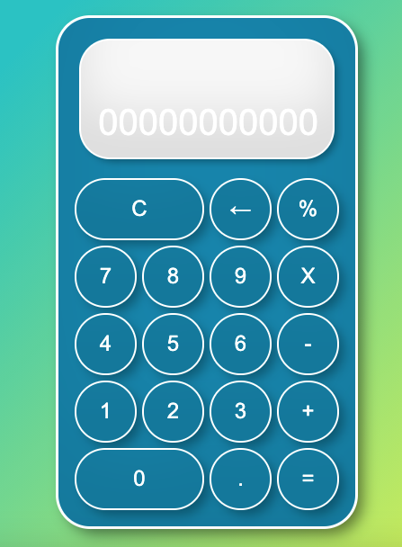

# Simulador de Calculadora

Se crea simulador  de calculadora basica con UI.

se utilizo JS, HTML5 y CSS3.

la calculadora realiza operaciones básicas
- suma
- resta
- multiplicación
- división

## Vista

Esta es la vista de la calculadora.

